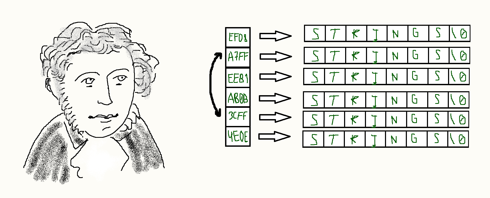

# StringsSorting

## Program Purpose

This program can sort the text from your file. The example is a excerpt from Alexander Sergeyevich Pushkin's work "Eugene Onegin".

## Supported comparators

- Normal comparator (strcmp()).
- Reverse comparator (reverse strcmp()).

## Supported sorters

- Primitive bubble sorter.
- Standart quick sorter.
- My version of quick sorter.

## Installation:
Bend the repository and compile the files

First step:
~~~
git clone https://github.com/R0flan4k/StringsSorting.git
~~~

Second step:
~~~
cd StringSorting\src
~~~

Third step:
~~~
make
~~~

## Usage

~~~
./StringSorting.exe --*sorter* --*comparator* --source *file name*
~~~

## Flags
- Sorter flags:

~~~
--qsort
~~~

~~~
--myqsort
~~~

~~~
--bubblesort
~~~

- Comparator flags:

~~~
--normal
~~~

~~~
--reverse
~~~

- Text file flag:

~~~
--source *text file*
~~~
